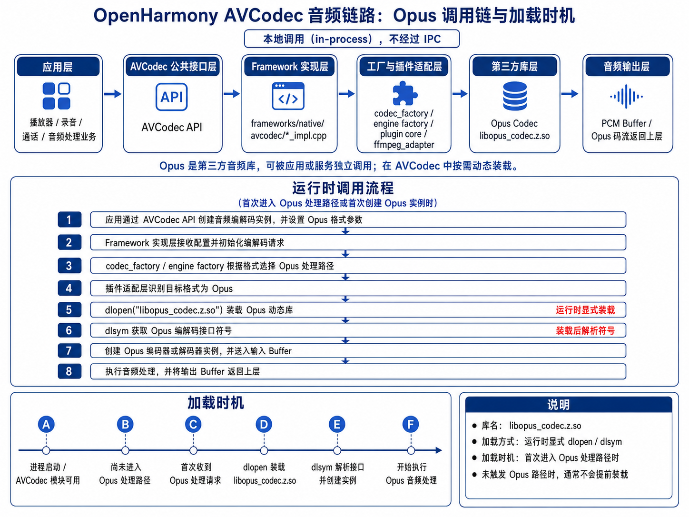

# Opus 音频库（libopus_codec.z.so）

## 简介

`Opus` 是一个开源、高效、低延迟的音频编解码库，支持高质量语音和音乐的编码与解码。本库是 Opus 在 OpenHarmony 中的适配版本，应用无需直接集成此库，通过 AVCodec Kit API 即可调用到本库提供的 Opus 编码能力，编译产物为 `libopus_codec.z.so`。

- **框架集成**：AVCodec 在进入 Opus 音频处理路径时，通过运行时动态装载方式调用 `libopus_codec.z.so`。

## 1. AVCodec 集成架构

Opus 在 AVCodec 音频链路中的调用关系如下：

```text
应用层 → AVCodec 公共接口层 → Framework 实现层 → 工厂/插件适配层 → libopus_codec.z.so → 音频输出
```

| 层级 | 说明 |
|------|------|
| **应用层** | 上层播放器、录音、通话或音频处理业务 |
| **AVCodec 公共接口层** | 对外提供统一的音频编解码能力入口 |
| **Framework 实现层** | 负责参数解析、实例创建、Buffer 管理及状态流转 |
| **工厂/插件适配层** | 根据 MIME 类型等信息选择 Opus 处理路径 |
| **第三方库层** | `libopus_codec.z.so`，按需动态装载 |
| **音频输出层** | 解码场景输出 PCM Buffer，编码场景输出 Opus 码流 |

### 运行时调用流程

1. 应用通过 AVCodec API 创建音频编解码实例，并设置 Opus 格式参数。
2. Framework 接收配置，工厂根据格式选择 Opus 处理路径。
3. 插件适配层调用 `dlopen("libopus_codec.z.so")` 装载动态库。
4. 通过 `dlsym` 获取编解码接口符号，创建 Opus 实例。
5. 送入输入 Buffer，执行编解码，将输出 Buffer 返回上层。

<div align="center">
  
  <br>
  <b>图 1</b> Opus 调用流程图
</div>
<br>

> **说明**：`libopus_codec.z.so` 的装载发生在运行期，仅在首次进入 Opus 处理路径时触发。未进入 Opus 路径时不会提前装载。

## 2. 目录结构

```text
third_party_opus/
├── BUILD.gn             # OpenHarmony 编译配置
├── README.OpenSource    # OpenHarmony 开源合规说明
├── bundle.json          # OpenHarmony 部件描述文件
├── OAT.xml              # OpenHarmony OAT 扫描配置
├── src/                 # Opus 源码及 demo
├── include/             # Opus 头文件
└── test/                # 测试代码
```

## 3. 编译构建

### 编译 64 位 ARM 目标

```bash
./build.sh --product-name {product_name} --ccache --target-cpu arm64 --build-target opus
```

> `{product_name}` 为当前支持的平台名称，例如 `rk3568`。

### 编译产物

构建完成后生成 Opus 动态库：

```text
libopus_codec.z.so
```

> AVCodec 使用 Opus 时，不通过 BUILD.gn 直接 deps 到主链路，而是在运行时通过 `dlopen` 按需装载 `libopus_codec.z.so`。

## 4. 注意事项

- `libopus_codec.z.so` 为 Opus 在 OpenHarmony 中的动态库产物名称。
- AVCodec 音频软编解码链路为本地调用链路，不经过 IPC。
- Opus 在 AVCodec 中采用运行时动态装载方式，需要处理 `dlopen` 失败和 `dlsym` 符号解析失败。
- 未触发 Opus 音频处理路径时，`libopus_codec.z.so` 不会被提前装载。
- **OpenHarmony 特有文件**：库中 `bundle.json`、`OAT.xml`、`README.OpenSource`、`BUILD.gn` 为 OpenHarmony 社区添加，用于部件描述、OAT 扫描、开源合规说明和 GN 构建集成。

## 5. 许可证

本项目基于 [BSD 3-Clause License](https://opensource.org/licenses/BSD-3-Clause) 开源，详见源码目录下的 LICENSE 文件。
